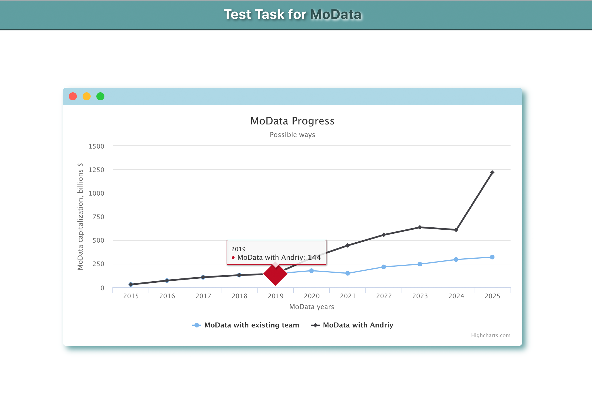

# Intro

This project is a test task for `MoData` Company. To make it working you need to have `Node` + `NPM` + `Git` installed on your computer.

 

## How to clone the repository

Open terminal and do

#### `git init`
#### `git clone git@github.com:aslobodyan/repo.git`

 

## How to run

To run the project just open `../MoData/` folder in any console and type there next command.

#### `npm install`
#### `npm start`

Runs the app in the development mode. 

 

## How to see this test app

Open [http://localhost:3000](http://localhost:3000) to view it in the browser.

The page will reload if you make edits. 
You will also see any lint errors in the console.

 { width: 300px }

Good luck, My Friend ;)
